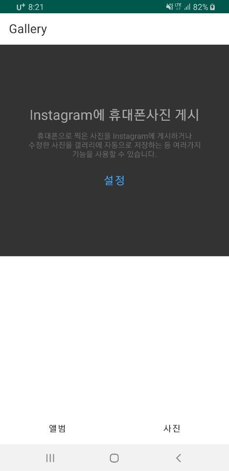
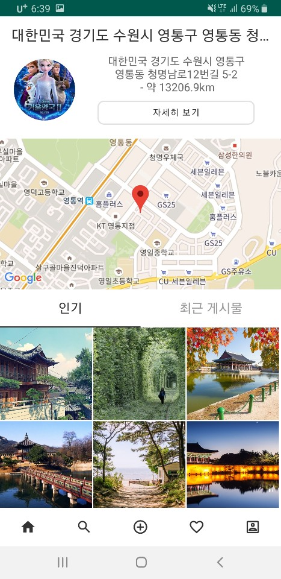
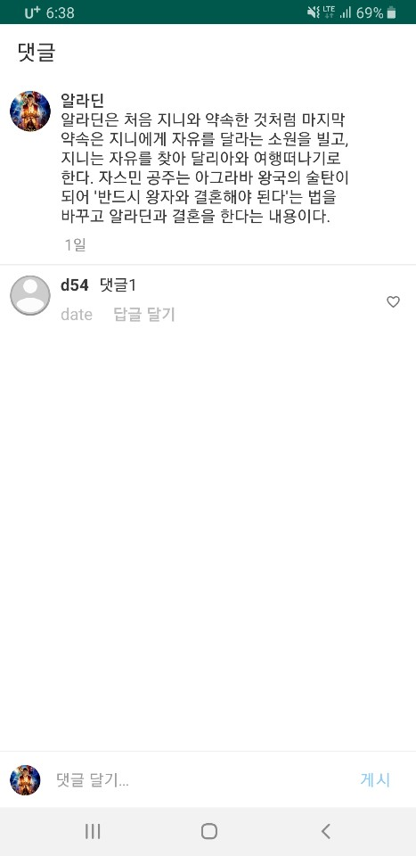

# ✨ Bongstagram

이 어플은 개발자의 UI와 기술 향상을 위해 만들어진 예시용 어플입니다.
사용 된 스킬 : Single Activity + Multiple Fragment, RecyclerView, Glide, GoogleMap, SharedPreference, Sort

## 🚀 BongStagram Demo App Table of Content
- [Main](##Main)
    - [MainActivity](#MainActivity)
- [Splash](#Splash)
    - [SplashFragment](#SplashFragment)
- [Home](#Home)
    - [HomeAdapter](#HomeAdapter)
    - [HomeFragment](#HomeFragment)
- [Search](#Search)
    - [SearchAdapter](#SearchAdapter)
    - [SearchFragment](#SearchFragment)
- [Gallery](#Gallery)
    - [GalleryFragment](#GalleryFragment)
- [Activity](#Activity)
    - [ActivityAdapter](#ActivityAdapter)
    - [ActivityFragment](#ActivityFragment)
- [Profile](#Profile)
    - [ProfileAdapter](#ProfileAdapter)
    - [ProfileFragment](#3ProfileFragment)
    - [ProfileModifyFragment](#ProfileModifyFragment)
- [Local](#Local)
    - [LocalFragment](#LocalFragment)
- [Google](#Google)
    - [GoogleAdapter](#GoogleAdapter)
    - [GoogleFragment](#GoogleFragment)
- [Reply](#Reply)
    - [ReplyAdapter](#ReplyAdapter)
    - [ReplyFragment](#ReplyFragment)

## Contents

-    
-   

## MainActivity

- 이 어플은 하나의 메인 엑티비티를 제외한 모든 화면구성은 Fragment로 되어있습니다.
메인 엑티비티에 구성되있는 기능들은 Toolbar, bottomnaigationView, enum Type으로 Fragment 분류, changeFragment는 Fragment전환을 위한 메소드 + 같은 Fragment가 중첩 안되게 하는 메소드.

      public void changeFragment(Type type, Fragment fragment) {                                 
            fragmentTag = fragment.getClass().getSimpleName();                                   
            if (type.ordinal() <= 1) {                                                       
                FragmentTransaction transaction = fm.beginTransaction();                     
                transaction.replace(R.id.contentFrame, fragment);                           
                transaction.commit();                                                       
            } else {                                                                             
                fm.popBackStack(fragmentTag, FragmentManager.POP_BACK_STACK_INCLUSIVE);     
                FragmentTransaction transaction = fm.beginTransaction();                         
                transaction.replace(R.id.contentFrame, fragment);
                transaction.addToBackStack(fragmentTag);                                         
                transaction.commit();
            }
         }

## SplashFragment

- 메인 엑티비티가 onCreate되면 \'changeFragment(Type.splash, splashFragment);\'
에 의해 SplashFragment가 띄워집니다.

      @Override    
      public void onViewCreated(@NonNull View view, @Nullable Bundle savedInstanceState) {    
      super.onViewCreated(view, savedInstanceState);    
          Handler hd = new Handler();    
          hd.postDelayed(new splashHandler(), 1000);    
      }    

      private class splashHandler implements Runnable{     
      @Override    
          public void run() {    
              Fragment homeFragment = new HomeFragment();    
              ((MainActivity)getActivity()).changeFragment(MainActivity.Type.home,      homeFragment);
          }        
      }    
   ⭐️1. ViewCreated되고 난후에 핸들러(hd)생성. "런어블객체(Runnable)를  delayMillis 후에 실행해라." 라는 메서드 입니다.
   
   - 위의 코드에서는 1000 을 주었으니 ( 시스템시간/1000 = 현재시간 )1초후( 1000/1000 ) 에 run()이 실행하게 됩니다.

   ⭐️2. run()이 실행 되면 SplashFragment HomeFragment로 전환됩니다.
   
## HomeFragment

- Data폴더에 있는 Movie에 items에 개수 만큼 HomeFragment에 있는 RecyclerView에 출력되고 HomeAdapter에서 처리해줍니다.

## SearchFragment

- SearchFragment에 있는 상단 EditTextView에 따라 Movie가 분류 되어 검색기능을 만듬.

      search_bar2.addTextChangedListener(new TextWatcher() {     
        @Override     
        public void beforeTextChanged(CharSequence s, int start, int count, int after) {}   
        @Override    
        public void onTextChanged(CharSequence s, int start, int before, int count) {    
            searchAdapter.getFilter().filter(s);     
        }       
        @Override     
        public void afterTextChanged(Editable s) {}          
      });
      
## GalleryFragment

- GalleryFramgent는 3가지의 Permission을 동의 받고 사용 가능하게 해야 합니다.

      private String[] PERMISSIONS = {
        android.Manifest.permission.CAMERA,
        android.Manifest.permission.WRITE_EXTERNAL_STORAGE,
        android.Manifest.permission.READ_EXTERNAL_STORAGE
      };

- 사용자가 동의의사에 따라 화면이 바뀌고, 동의 시 카메라 기능과 앨범에 있는 사진 가져오기 기능을 사용 할 수 있습니다.
- 사진 촬영시 그냥 사진을 가져오게 될 경우, 회전되어 있는 사진을 정방향으로 돌려주는 메소드.
- 사진의 회전값 가져오기. 사진의 회전값을 처리하지 않으면 사진을 찍은 방향대로 이미지뷰에 처리되지 않습니다.

      private int exifOrientationToDegrees(int exifOrientation) {
        if (exifOrientation == ExifInterface.ORIENTATION_ROTATE_90) {
            return 90;
        } else if (exifOrientation == ExifInterface.ORIENTATION_ROTATE_180) {
            return 180;
        } else if (exifOrientation == ExifInterface.ORIENTATION_ROTATE_270) {
            return 270;
        }
        return 0;
      }
- 사진 촬영 후 파일 저장 후 폴더 새로고침 해주는 메소드.

      private void galleryAddPic() {
        Intent mediaScanIntent = new Intent(Intent.ACTION_MEDIA_SCANNER_SCAN_FILE);
        File f = new File(imageFilePath);
        Uri contentUri = Uri.fromFile(f);
        mediaScanIntent.setData(contentUri);
        getActivity().sendBroadcast(mediaScanIntent);
      }

## ActivityFragment

- Movie에 items를 날짜와 시간에 따라 분류한 Fragment.
- 받아온 arraylist를 오름차순 정렬해주는 메소드.

      private void sorting(ArrayList arrayList){
        Collections.sort(arrayList, new Comparator<MovieList>(){
            @Override
            public int compare(MovieList o1, MovieList o2){
                return o2.getDate().compareTo(o1.getDate());
            }
        });
      }

## Profile

  ### ProfileFragment

- SharedPreference에 저장한 데이터가 있으면 \'getSharedPreferences()\'로 데이터를 보여주는 Fragment.
- 저장된 데이터가 없을 시 각각의 View들은 Invisible처리가 되고 WebSite 값이 있고 클릭 시, Url연결 가능.

      tv3.setOnClickListener(v -> {
          connectURL();
          if (connectURL().resolveActivity(context.getPackageManager()) != null) {
              startActivity(connectURL());
          }
      });

  ### ProfileModifyFragment
 
- SharedPreference를 저장하는 Fragment. 앨범을 사용하기 때문에 2가지의 Permission이 필요하다.

      [android.Manifest.permission.WRITE_EXTERNAL_STORAGE, android.Manifest.permission.READ_EXTERNAL_STORAGE]

- Url입력 시 Url형식이 맞는지 확인 후 Url형식이 아닐 경우 저장 불가 동시에 ToastMessage출력.
      
      private boolean checkURL(String url) {
          Pattern p = Patterns.WEB_URL;
          Matcher m = p.matcher(url.toLowerCase());
          return m.matches();
      }
      
## LocalFragment

- 자신의 위치를 알수 있는 Fragment. 위치 정보 제공에 동의하지 않을 시, 주소 발견 할 수 없음.
- GoogleFragment에서 '자세히보기' 클릭시 전환

      Button localDetail = view.findViewById(R.id.custom_btn);
        localDetail.setOnClickListener(v -> {
            Log.e("click", "local");
            Fragment localFragment = new LocalFragment();
            ((MainActivity) getActivity()).changeFragment(MainActivity.Type.local, localFragment);
      });
      
## Reply

- 게시물에 대해 댓글과 대댓글을 달수 있는 Fragment.

### ReplyFragment
    
- ReplyAdapter를 implements해서 ReplyAdapterMethod 이용한 RecyclerView 댓글을 삭제

      implements ReplyAdapter.OnItemClickListener
      
- 댓글이나 대댓글 레이아웃 클릭시 답글달기, 하트버튼 사용 불가. 댓글이나 대댓글 삭제 혹은 취소 가능.

      @Override
      public void onLayOutSelected(View v, int position, SparseBooleanArray mSelectedItems,       boolean setEnabled) {
          replyAdapter.notifyDataSetChanged();

          toggleItemSelected(position, mSelectedItems);
          countItemsTitle(mSelectedItems);
          setEnabledBtn(mSelectedItems);
  
          ImageView replyToClose = this.getView().findViewById(R.id.reply_Close);
          replyToClose.setOnClickListener(v1 -> {
              clearSelectedItems(mSelectedItems);
              toolbarToggle(mSelectedItems);
              setEnabledBtn(mSelectedItems);
          });
          ImageView trashBtn = this.getView().findViewById(R.id.reply_Trash);
          trashBtn.setOnClickListener(v1 -> {
              deleteMethod(mSelectedItems);
              toolbarToggle(mSelectedItems);
              setEnabledBtn(mSelectedItems);
          });
      }

- ReplyFragment하단에 EditTextView 클릭시 소프트 키보드 보여주는 메소드와 숨기는 메소드.
      
      private void showKeyBoard() {
          if (replyId != null) {
              String text = "@" + replyId.substring(0, 3) + " ";
              replyEditText.setText(text);
              replyEditText.setSelection(replyEditText.length());
          }
          InputMethodManager imm = (InputMethodManager)   Objects.requireNonNull(getContext()).getSystemService(Context.INPUT_METHOD_SERVICE);
          imm.showSoftInput(replyEditText, 0);
      }
      
      private void hideKeyBoard() {
          InputMethodManager imm = (InputMethodManager)   Objects.requireNonNull(getContext()).getSystemService(Context.INPUT_METHOD_SERVICE);
          imm.hideSoftInputFromWindow(replyEditText.getWindowToken(), 0);
      }
    
### ReplyAdapter

- onBindViewHolder에선 View를 항상 그려주고 데이터 적인건 따로 처리 해주는게 좋습니다.
- 댓글뷰인 VIEW_TYPE_A, 대댓글뷰인 VIEW_TYPE_B로 나누고 댓글 입력 방식에 따라 맞는 뷰를 리턴

      @Override
      public int getItemViewType(int position) {
          if (replyLists.get(position).getItemViewType() == 0) {
              return ReplyFragment.VIEW_TYPE_A;
          } else {
              return ReplyFragment.VIEW_TYPE_B;
          }
      }
      
- 하트 버튼 클릭시 애니메이션과 동시에 하트 채우기(애니메이션리스너)

      private void animationListener(Animation mAnim, ImageView likeBtn, int position) {
          mAnim.setAnimationListener(new Animation.AnimationListener() {
              @Override
              public void onAnimationStart(Animation animation) {}
  
              @Override
              public void onAnimationEnd(Animation animation) {
                  likeCount(position, likeBtn);
              }

              @Override
              public void onAnimationRepeat(Animation animation) {}
          });
          likeBtn.startAnimation(mAnim);
      }

- 댓글이나 대댓글 생성 특정시간을 불러와서 현재시간이랑 비교 후 분,시,일,월,년 계산 해서 스트링 반환하는 예제입니다.
      
      private static class TIME_MAXIMUM{
          static final int SEC = 60;
          static final int MIN = 60;
          static final int HOUR = 24;
          static final int DAY = 30;
          static final int MONTH = 12;
      } 

      public static String formatTimeString(long regTime){
        long curTime = System.currentTimeMillis();
        long diffTime = (curTime - regTime) / 1000;
        String msg= null;

      if(diffTime < TIME_MAXIMUM.SEC){
              msg = "방금 전";
          } else if ((diffTime /= TIME_MAXIMUM.SEC) < TIME_MAXIMUM.MIN) {
              msg = diffTime + "분 전";
          } else if ((diffTime /= TIME_MAXIMUM.MIN) < TIME_MAXIMUM.HOUR) {
              msg = (diffTime) + "시간 전";
          } else if ((diffTime /= TIME_MAXIMUM.HOUR) < TIME_MAXIMUM.DAY) {
              msg = (diffTime) + "일 전";
          } else if ((diffTime /= TIME_MAXIMUM.DAY) < TIME_MAXIMUM.MONTH ) {
              msg = (diffTime) + "달 전";
          } else {
              msg = (diffTime) + "년 전";
          }
          return  msg;
      }
      
## Author

👤 **이봉희(BongHee Lee)**

- Github: [@maxbongbong](https://github.com/maxbongbong) - https://github.com/maxbongbong 
